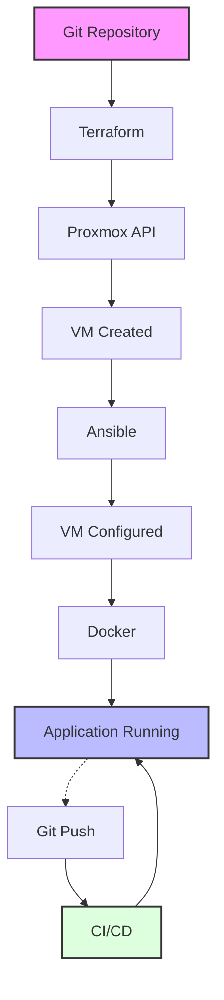

# Home-Lab DevOps blueprint

- [Home-Lab DevOps blueprint](#home-lab-devops-blueprint)
  - [From clicking around to infrastructure as code](#from-clicking-around-to-infrastructure-as-code)
- [The architecture](#the-architecture)
- [Step 1: Infrastructure as code with terraform](#step-1-infrastructure-as-code-with-terraform)
- [Step 2: Configuration management with ansible](#step-2-configuration-management-with-ansible)
- [Step 3: Containerization with docker](#step-3-containerization-with-docker)
- [Step 4: CI/CD and automated delivery](#step-4-cicd-and-automated-delivery)
- [Guided project: Automated static site](#guided-project-automated-static-site)
- [What this homelab really trains](#what-this-homelab-really-trains)


## From clicking around to infrastructure as code

Most homelabs start the same way: install Proxmox, spin up a VM, click through a few settings, install packages over SSH, call it a day.

It works. It’s satisfying. It teaches the basics.

It’s also nothing like how serious infrastructure is built.

Production systems aren’t assembled through dashboards. They’re declared in code, reviewed in pull requests, applied through pipelines, and rebuilt without ceremony when something breaks. If you’re using a homelab to learn DevOps, that’s the standard worth practicing against.

This blueprint walks through a practical transformation:

* Terraform defines infrastructure.
* Ansible configures operating systems.
* Docker runs applications.
* CI/CD automates delivery.

The goal isn’t to host a static site. It’s to think and operate like an engineer responsible for uptime and change control.

---

# The architecture


At a high level:



Each layer has a boundary:

| Layer          | Tool      | Responsibility                 |
| -------------- | --------- | ------------------------------ |
| Infrastructure | Terraform | Provision virtual machines     |
| Configuration  | Ansible   | Install and configure software |
| Runtime        | Docker    | Run application workloads      |
| Delivery       | CI/CD     | Build and deploy changes       |

Blurring these responsibilities leads to brittle systems. Keeping them separate keeps you sane.

---

# Step 1: Infrastructure as code with terraform

The difference between a hobby setup and an engineered system is repeatability.

If your Proxmox VM exists only because you clicked “Create”, then it exists only in that moment. Rebuild the host and you’re back to square one. Terraform changes that equation.

Terraform describes infrastructure declaratively. You define what should exist. Terraform calculates the delta between the current state and the declared state, then calls the Proxmox API to reconcile the two.

A minimal configuration looks like this:

```hcl
resource "proxmox_virtual_environment_vm" "docker_host" {
  name      = "docker-host-01"
  node_name = "proxmox"
  vm_id     = 100

  clone {
    vm_id = 9000
  }

  cpu {
    cores = 2
  }

  memory {
    dedicated = 4096
  }

  network_device {
    bridge = "vmbr0"
  }
}
```

The mechanics matter, but the state model matters more. Terraform maintains a state file that maps declared resources to real objects inside Proxmox. Lose that file and Terraform no longer knows what it owns. In production, state lives in remote backends with locking and versioning. In a homelab, local state is fine, but understand what you’re trading off.

Security discipline starts here as well. API tokens don’t belong in source code. Use variables and environment injection. If you’re committing secrets to Git, you’re rehearsing bad habits.

The workflow should feel boring:

* `terraform init`
* `terraform validate`
* `terraform plan`
* `terraform apply`

Plan first. Apply second. That muscle memory translates directly to cloud platforms later.

---

# Step 2: Configuration management with ansible

Provisioning a VM gives you a blank operating system. It doesn’t give you a Docker host, firewall rules, users, or logging agents.

You can SSH in and configure it manually. You can also do that 50 more times when you scale out. Most people choose the former until it stops being practical.

Ansible solves the consistency problem. It connects over SSH, runs idempotent tasks, and leaves the machine in a defined state. No agent required.

A basic playbook to install Docker might look like this:

```yaml
- name: Setup docker host
  hosts: docker_hosts
  become: yes

  tasks:
    - name: Install dependencies
      apt:
        name:
          - ca-certificates
          - curl
          - gnupg
        state: present
        update_cache: yes

    - name: Add Docker GPG key
      apt_key:
        url: https://download.docker.com/linux/ubuntu/gpg
        state: present

    - name: Add Docker repository
      apt_repository:
        repo: "deb https://download.docker.com/linux/ubuntu {{ ansible_distribution_release | default('noble') }} stable"
        state: present

    - name: Install Docker engine
      apt:
        name: docker-ce
        state: present
        update_cache: yes

    - name: Ensure Docker is running
      service:
        name: docker
        state: started
        enabled: yes
```

The key word is idempotent. If Docker is already installed, Ansible doesn’t reinstall it. If the service is running, it doesn’t restart it unnecessarily. You can run the playbook again tomorrow and it won’t degrade the system.

Structure also matters. As your lab grows, use roles:

```
ansible/
├── inventory.ini
├── site.yml
└── roles/
    └── docker/
        └── tasks/main.yml
```

This isn’t overengineering. It’s rehearsal for environments where multiple engineers maintain the same automation repository.

---

# Step 3: Containerization with docker

Virtual machines are coarse-grained isolation. Containers operate at a finer level.

Instead of installing Nginx directly onto the host, define it in `docker-compose.yml`:

```yaml
services:
  web:
    image: nginx:1.25-alpine
    ports:
      - "80:80"
    restart: unless-stopped
    healthcheck:
      test: ["CMD", "curl", "-f", "http://localhost"]
      interval: 30s
      retries: 3
```

Pin versions. Avoid `latest`. Add health checks. Specify restart policies. These aren’t academic details. They determine how your system behaves at 3 a.m. when something fails.

With Docker, your application becomes an artifact. It can be built in CI, tagged, pushed to a registry, and pulled onto any compatible host. That separation between build and run is what makes automated delivery viable.

Use the integrated CLI:

```
docker compose up -d
```

Your homelab now runs workloads the same way many production stacks do.

---

# Step 4: CI/CD and automated delivery

Without CI/CD, deployment is an SSH habit.

You log in, pull changes, restart services, hope nothing breaks. That doesn’t scale and it doesn’t leave an audit trail.

With a pipeline, change is event-driven. A Git push triggers a build, the build produces an image, the image is pushed to a registry, and the server updates itself.

A stripped-down GitHub Actions workflow might include:

```yaml
- name: Build image
  run: docker build -t youruser/myapp:latest .

- name: Login to Docker Hub
  run: echo "${{ secrets.DOCKER_PASSWORD }}" | docker login -u "${{ secrets.DOCKER_USERNAME }}" --password-stdin

- name: Push image
  run: docker push youruser/myapp:latest
```

On the server side, a simple update routine:

```
docker compose pull
docker compose up -d
```

The server doesn’t need your source code. It needs a trusted image and instructions to refresh it. Secrets live in repository settings, not in plaintext files. Every deployment is traceable to a commit hash.

You’ve moved from manual change to controlled release.

---

# Guided project: Automated static site

To tie everything together, build a small static site pipeline.

**Phase 1: Infrastructure**

* Create an Ubuntu cloud-init template in Proxmox.
* Use Terraform to clone it into `docker-host-01`.

**Phase 2: Configuration**

* Use Ansible to install Docker from the official repository.
* Ensure the Docker service starts on boot.
* Add your deployment user to the `docker` group.

**Phase 3: Application**

Project structure:

```
my-app/
├── Dockerfile
├── index.html
└── docker-compose.yml
```

`Dockerfile`:

```dockerfile
FROM nginx:1.25-alpine
COPY index.html /usr/share/nginx/html/index.html
```

Build locally, test, then wire it into CI so that every push builds and publishes the image.

**Phase 4: Deployment**

* Store registry credentials and SSH keys as repository secrets.
* Let the pipeline build and push the image.
* Trigger a remote update that pulls and restarts the container.

Now rebuild the entire environment from scratch: destroy the VM, run `terraform apply`, execute your Ansible playbook, let the pipeline redeploy the app. If that sequence works end to end, you’re operating at a different level than someone who can only keep a single snowflake server alive.

---

# What this homelab really trains

A well-built homelab is a rehearsal space for production responsibility.

You practice:

* Version-controlled infrastructure.
* Idempotent configuration.
* Artifact-based deployment.
* Secret management discipline.
* Change management through pull requests.

None of that requires a cloud budget or a team of engineers. It requires intention and a refusal to rely on dashboards and muscle memory.

If your lab can rebuild itself from code, recover from destruction without guesswork, and deploy changes without manual SSH sessions, you’re not just running services at home. You’re running an engineered system.
