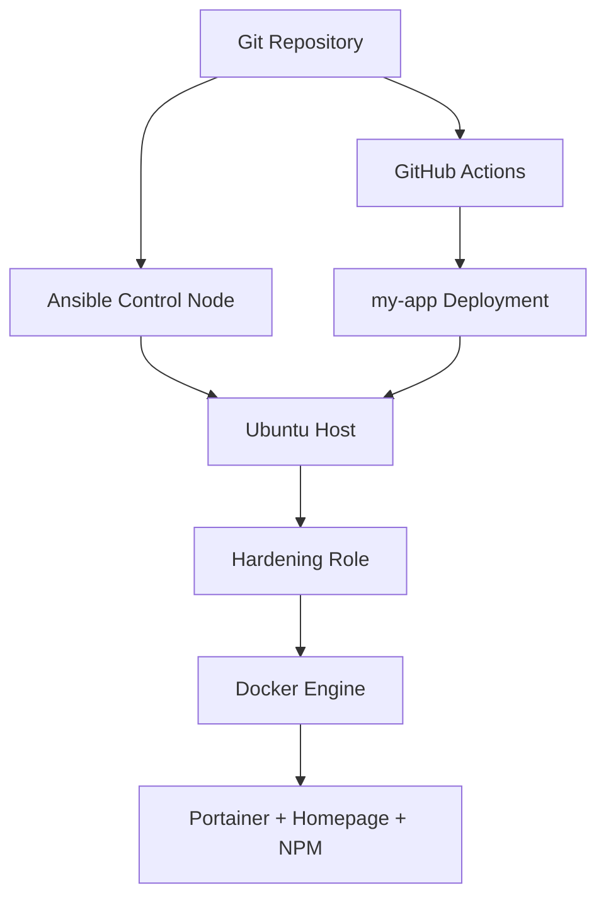

# Ansible-First Homelab Blueprint

Lab 1 proved that a full stack of Proxmox, Terraform, Ansible, Docker, and CI/CD can work together in a disciplined way.

Lab 2 asks a harder and more mature question:

**Should every environment use that full stack?**

Sometimes the answer is yes. Sometimes it is not.

For this host, the virtualization layer was not the real problem. The real problem was configuration drift after the operating system existed. Once that became clear, the architecture changed: install Ubuntu manually once, then let Ansible own everything that matters after first boot.

That is not backing away from infrastructure as code. It is applying it at the layer that produces the most value.

---

## The Core Decision

Lab 2 deliberately removes two things from the center of the design:

- Proxmox automation
- Terraform-driven VM lifecycle

That does not mean those tools are bad. It means they were not the right center of gravity for this particular use case.

The machine in Lab 2 is a persistent homelab host, not a frequently replaced ephemeral VM fleet. The bigger risk was not "I cannot create a VM fast enough." The bigger risk was "I will keep making host and app changes manually, and six months later I will not fully know what is true anymore."

Ansible addresses that directly.

---

## What “Ansible-First” Actually Means

Ansible-first does not mean Ansible should do everything in every environment.

It means Ansible is the primary source of truth for:

- host security posture
- package policy
- service enablement
- Docker runtime setup
- stack deployment
- operational verification steps

In Lab 2, once SSH access is available, the host should become progressively less manual over time, not more.

That is the important shift.

---

## Why This Is Still Infrastructure Discipline

A common mistake is to think that if Terraform is absent, discipline is absent.

That is too shallow.

Infrastructure discipline comes from properties like:

- repeatability
- auditability
- explicit configuration
- change review
- controlled drift

Lab 2 still has those properties:

- configuration lives in Ansible roles
- defaults are explicit
- service composition is templated
- validation commands are documented
- known issues are tracked in a backlog instead of ignored

The one-time Ubuntu installation is manual. The ongoing operating model is not.

---

## Tradeoffs, Not Dogma

Lab 2 is not "better than Lab 1" in a universal sense.

Lab 1 is stronger when:

- you need reproducible VM lifecycle management
- you want to practice full-stack IaC patterns
- rebuilding infrastructure frequently is part of the goal

Lab 2 is stronger when:

- you already have a stable host
- your operational pain is mostly post-install configuration drift
- you want fewer moving parts
- you care more about hardening and host management than VM provisioning

The engineering move is not to worship simplicity or complexity. It is to choose the amount of system that matches the problem.

---

## The Architectural Shape

At a high level, Lab 2 looks like this:

The key difference from Lab 1 is what is missing:

- no hypervisor provisioning workflow
- no Terraform state lifecycle
- no cloud-init template dependency

That absence is part of the design, not an omission.

---

## The Real Learning

The most useful lesson in Lab 2 is that "more automated" is not always the same as "better designed."

A mature homelab does not copy every production pattern blindly. It chooses the patterns that create clarity, repeatability, and leverage.

Lab 2 is a smaller system than Lab 1.

That is exactly why it is worth documenting.
